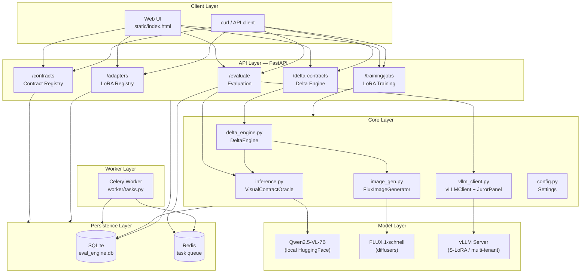
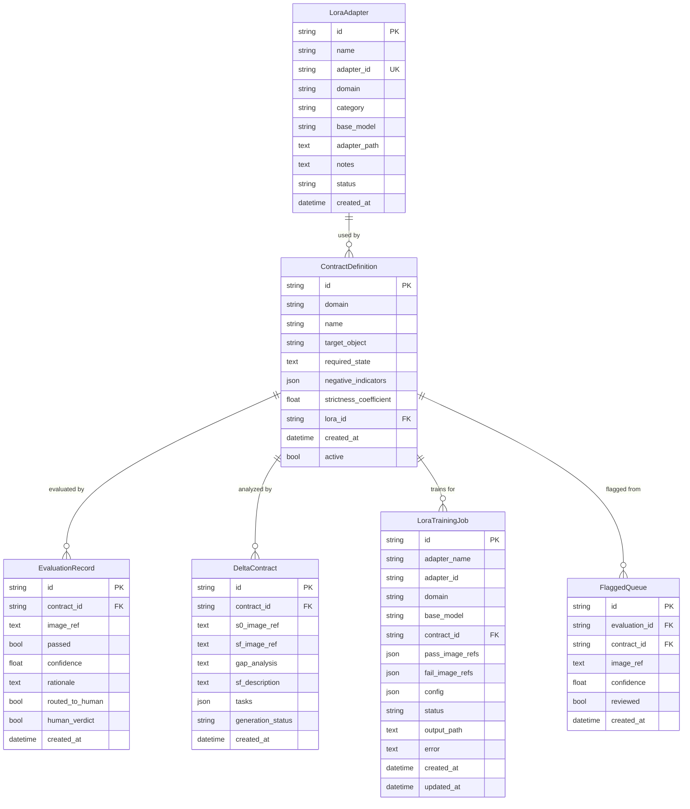
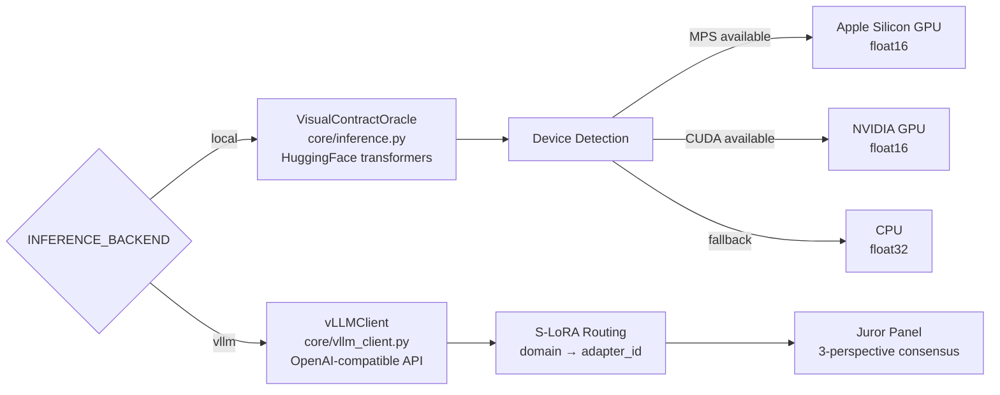
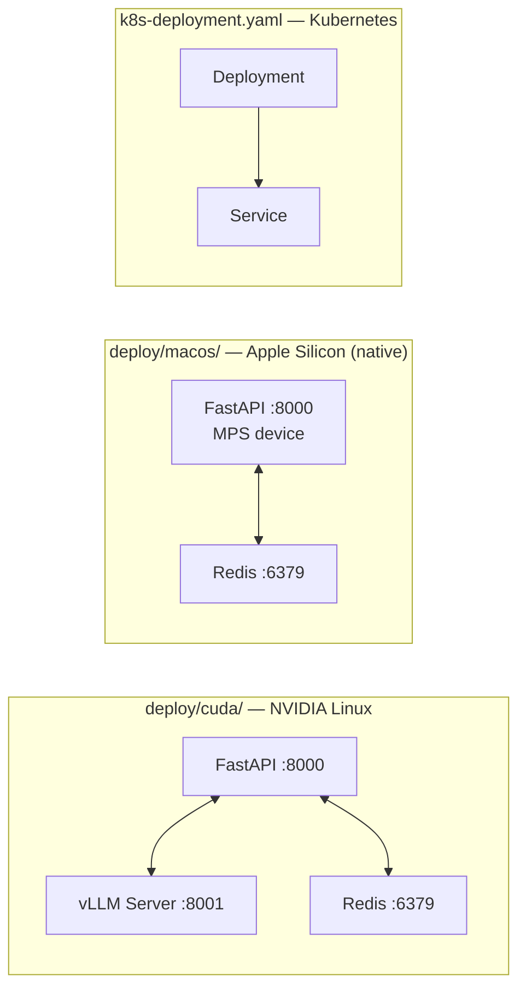

# System Architecture

## High-Level Overview

---

## Component Responsibilities

| Component | File | Role |
|-----------|------|------|
| **Web UI** | `static/index.html` | SPA — Register Contract, Delta Contract, Evaluate, Train LoRA tabs |
| **FastAPI App** | `main.py` | Router registration, lifespan DB init, static file serving |
| **Config** | `core/config.py` | Pydantic BaseSettings — all tunables from `.env` |
| **Local Oracle** | `core/inference.py` | HuggingFace Qwen2.5-VL inference, JSON parsing, confidence scoring |
| **vLLM Client** | `core/vllm_client.py` | OpenAI-compatible async client, S-LoRA routing, juror panel |
| **Delta Engine** | `core/delta_engine.py` | S0→SF gap analysis, task decomposition, contract field derivation |
| **Image Gen** | `core/image_gen.py` | FLUX.1 text-to-image with VLM memory swap |
| **DB Models** | `db/models.py` | SQLAlchemy ORM — 6 tables |
| **CRUD** | `db/crud.py` | Async DB queries & mutations |
| **Session** | `db/session.py` | Async engine, `get_session` dependency, `init_db` |
| **Worker** | `worker/tasks.py` | Celery tasks — active learning, retrain triggers |

---

## Database Schema

---

## Inference Backend Selection

---

## Deployment Topology

