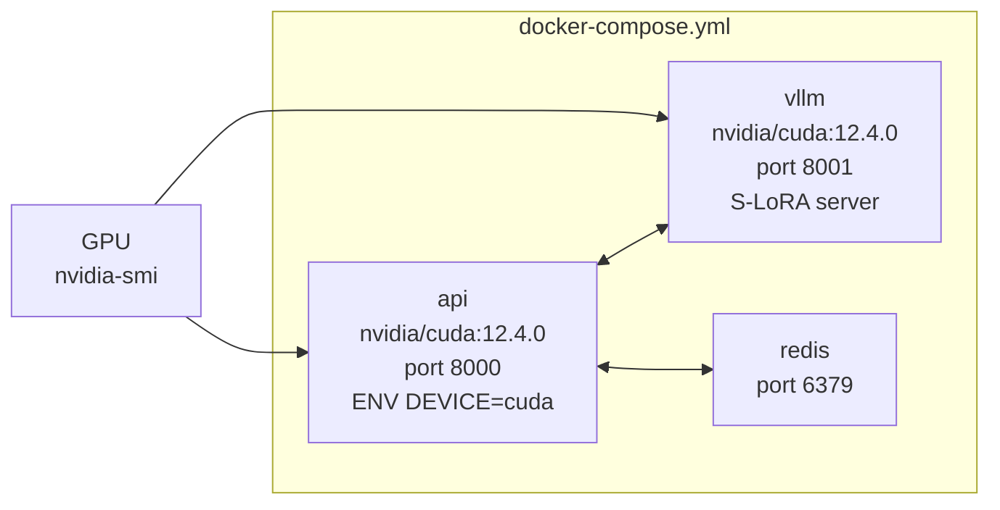

# Deployment Guide

## Quick Start (Local Development)

```bash
# 1. Install dependencies
poetry install --extras local-mps   # Apple Silicon
poetry install --extras local-gpu   # Linux / CUDA

# 2. Configure
cp .env.example .env
# Set INFERENCE_BACKEND=local, adjust device if needed

# 3. Run
poetry run python main.py
# or: poetry run uvicorn main:app --host 0.0.0.0 --port 8000 --reload

# 4. Open UI
open http://localhost:8000
```

The server binds to `0.0.0.0:8000` — accessible on the local network.  
The SQLite database (`eval_engine.db`) and image store (`data/images/`) are created automatically on first start.

---

## Environment Variables

```bash
# Inference
INFERENCE_BACKEND=local          # local | vllm
DEVICE=auto                      # auto | mps | cuda | cpu
LOCAL_MODEL_ID=Qwen/Qwen2.5-VL-7B-Instruct

# vLLM (production only)
VLLM_BASE_URL=http://localhost:8001/v1
VLLM_API_KEY=token
VLLM_DEFAULT_MODEL=Qwen/Qwen2.5-VL-7B-Instruct

# Database
DATABASE_URL=sqlite+aiosqlite:///./eval_engine.db

# Redis (required for Celery workers)
REDIS_URL=redis://localhost:6379/0

# Human review bands
HUMAN_REVIEW_LOWER=0.45
HUMAN_REVIEW_UPPER=0.65

# Active learning thresholds
LORA_RETRAIN_THRESHOLD=0.95
LORA_RETRAIN_WINDOW=100

# Flux.1 image generation
GENERATE_SF_IMAGE=true
FLUX_MODEL_ID=black-forest-labs/FLUX.1-schnell
FLUX_IMAGE_WIDTH=1024
FLUX_IMAGE_HEIGHT=1024
# FLUX_NUM_STEPS=4         # leave unset to use model defaults
# FLUX_GUIDANCE_SCALE=0.0
```

---

## CUDA / Linux (`deploy/cuda/`)

Requires: Docker, NVIDIA Container Toolkit, GPU with ≥ 16 GB VRAM.

```bash
cd deploy/cuda
docker compose up --build
```



The `api` and `vllm` services both request GPU access via:
```yaml
deploy:
  resources:
    reservations:
      devices:
        - driver: nvidia
          count: all
          capabilities: [gpu]
```

The `poetry install --extras local-gpu` step installs the CUDA-enabled torch wheel.

---

## macOS / Apple Silicon (`deploy/macos/`)

### Docker (CPU only)
MPS is not available inside Docker containers — the macOS GPU driver is host-only.

```bash
cd deploy/macos
docker compose up --build
# DEVICE=cpu, slower inference
```

### Native (recommended for MPS)

Run directly with Poetry — the MPS backend is only accessible from the host process.

```bash
poetry install --extras local-mps
DEVICE=mps poetry run python main.py
```

---

## Flux.1 — HuggingFace Auth

FLUX.1 models are gated on HuggingFace and require a token:

```bash
huggingface-cli login
# Accept the license at https://huggingface.co/black-forest-labs/FLUX.1-schnell
```

Install the extra dependencies:

```bash
poetry install --extras local-flux
```

---

## Memory Requirements

| Component | VRAM | Notes |
|-----------|------|-------|
| Qwen2.5-VL-7B | ~14 GB | float16; loaded once on first request |
| FLUX.1-schnell | ~12 GB | float16; loaded per Delta generation, then offloaded |
| Both simultaneously | > 26 GB | Use memory-swap path (automatic, see [workflow.md](workflow.md)) |
| vLLM S-LoRA base | ~14 GB | + ~500 MB per loaded adapter |

For systems with < 24 GB VRAM, the three-phase memory swap keeps peak usage under 16 GB:
1. Offload Qwen oracle → CPU RAM
2. Load Flux → device (12 GB)
3. Generate → offload Flux → CPU RAM
4. Restore Qwen → device

---

## Kubernetes (`deploy/k8s-deployment.yaml`)

Basic single-replica deployment suitable as a starting point:

```bash
kubectl apply -f deploy/k8s-deployment.yaml
```

For production, add:
- `PersistentVolumeClaim` for `data/images/` and `eval_engine.db`
- `Secret` for `.env` values
- GPU `nodeSelector` / `tolerations` for the vLLM deployment
- Horizontal Pod Autoscaler for the API tier

---

## Starting the Celery Worker

The background worker is optional — evaluations still work without it, but low-confidence records won't be auto-queued for review.

```bash
# Redis must be running
poetry run celery -A worker.tasks worker --loglevel=info
```

---

## Production Checklist

- [ ] Switch `DATABASE_URL` to PostgreSQL (`postgresql+asyncpg://...`)
- [ ] Set `INFERENCE_BACKEND=vllm` and configure `VLLM_BASE_URL`
- [ ] Run `huggingface-cli login` before first Flux generation
- [ ] Mount `data/` as a persistent volume (images + database)
- [ ] Set a real `VLLM_API_KEY` (not `token`)
- [ ] Enable Celery worker for active learning loop
- [ ] Add HTTPS termination (Nginx / Caddy in front of port 8000)
