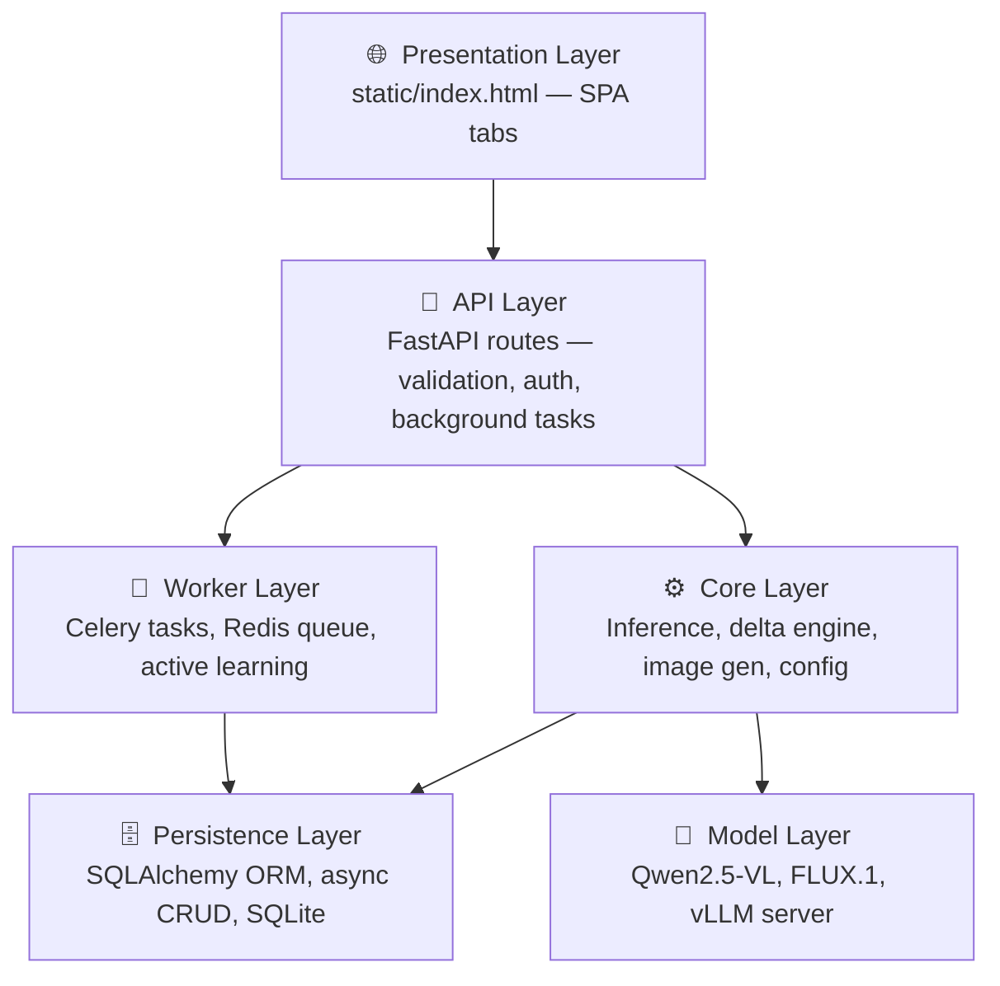
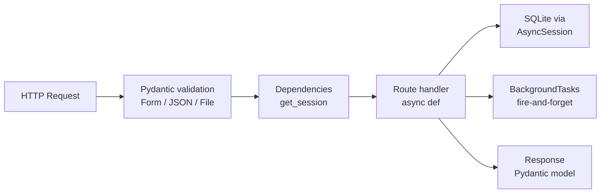
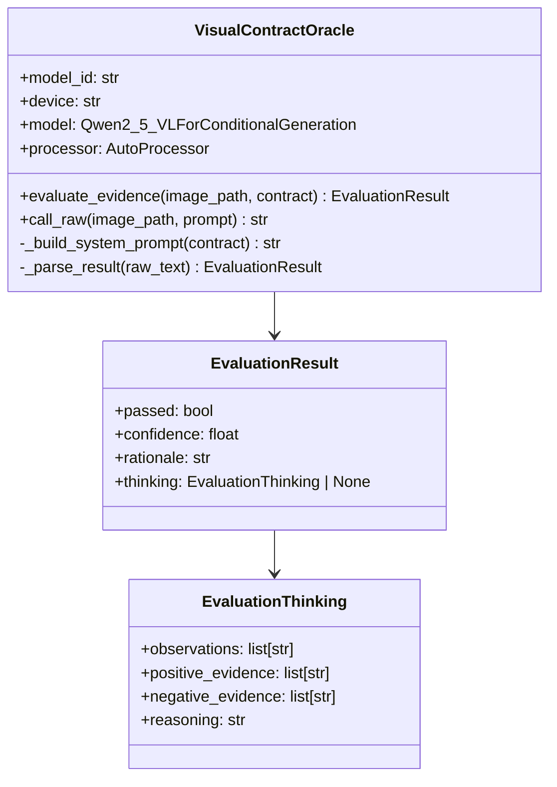
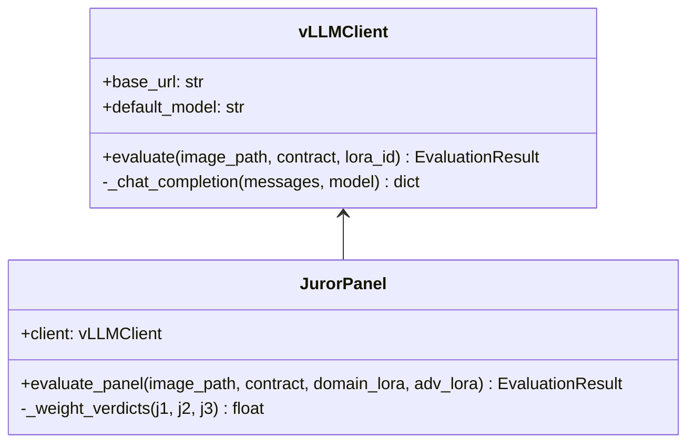
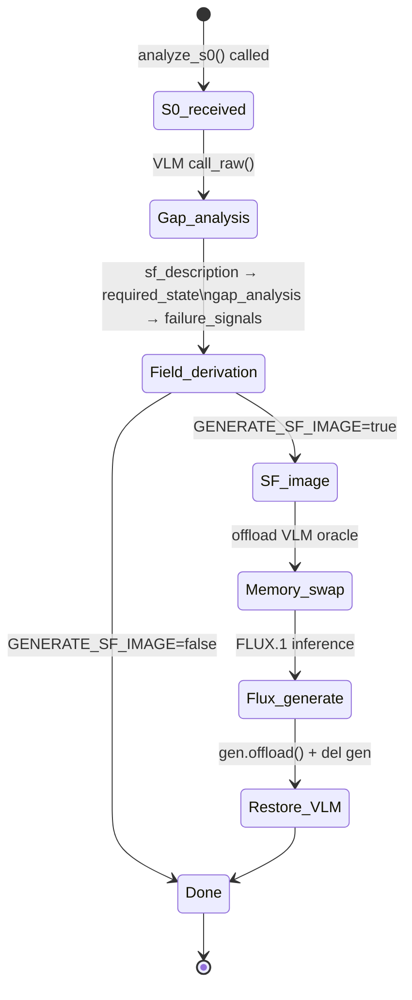
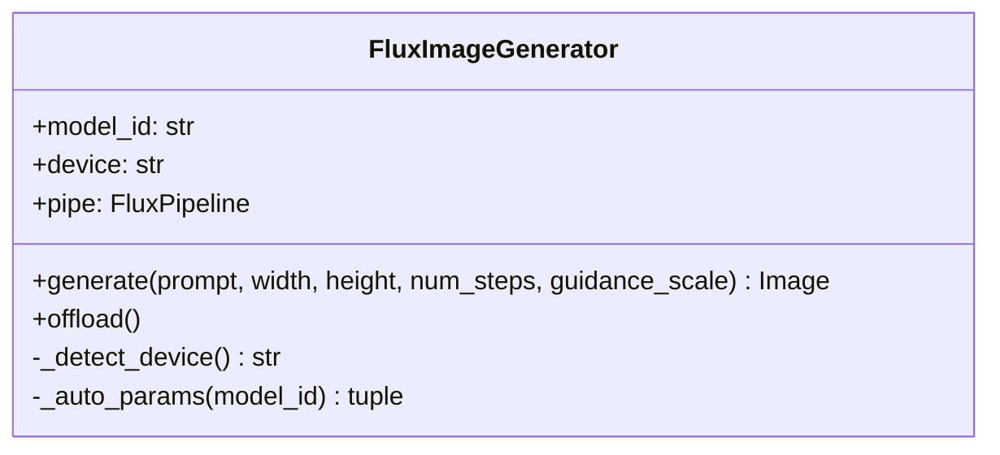

# Layer Reference

## Layer Stack



---

## Layer 0 — Presentation

**File**: `static/index.html`  
**Served at**: `GET /`

Single-page application with four tabs. All data access is via `fetch()` against the same-origin FastAPI server.

### Tabs

| Tab | Purpose | Key API calls |
|-----|---------|---------------|
| 📋 Register Contract | Create visual assertion contracts | `POST /contracts`, `GET /adapters` |
| 🔀 Delta Contract | Upload S0 image, trigger gap analysis | `POST /delta-contracts`, `GET /delta-contracts/{id}` |
| 🔍 Evaluate Image | Submit image for contract evaluation | `GET /contracts`, `POST /evaluate` |
| 🧠 Train LoRA | Upload PASS/FAIL sets, train adapter | `POST /training/jobs`, `GET /training/jobs/{id}` |

### Shared UI State

```
contracts[]          — loaded on init, used in Evaluate + Train tabs
deltaSuggestions     — {gapAnalyses[], sfDescriptions[]} — textarea autocomplete
trainFiles           — {pass: File[], fail: File[]} — in-memory, sent in FormData
```

### Design Patterns

- **Autocomplete**: `makeTextareaSuggest(fieldId, getSuggestions)` — keyboard-navigable dropdown bound to any `<textarea>`
- **Rank/LR pills**: `.rank-btn` / `.lr-btn` — mutually-exclusive toggle buttons write to hidden `<input>` fields
- **Image thumbnails**: `URL.createObjectURL()` for instant preview without server upload
- **Job polling**: `pollTrainingJob(jobId)` / `pollDeltaJob(deltaId)` — 3s `setTimeout` loop, stops on terminal state
- **Memory-free**: No framework dependencies — vanilla JS + CSS custom properties

---

## Layer 1 — API

**Files**: `main.py`, `api/routes/*.py`  
**Framework**: FastAPI 0.115+ (async)

### Routers

```
/contracts          → api/routes/contracts.py
/delta-contracts    → api/routes/delta_contracts.py
/evaluate           → api/routes/evaluation.py
/adapters           → api/routes/adapters.py
/training/jobs      → api/routes/training.py
/images/{filename}  → main.py (static file serving)
/health             → main.py
```

### Request Lifecycle



### Background Task Pattern

Used in both `/delta-contracts` and `/training/jobs`:

```python
# Route returns immediately after DB record created
background_tasks.add_task(_run_analysis, delta_id=..., s0_path=...)

# Background coroutine opens its own DB session
async def _run_analysis(delta_id, s0_path):
    async with AsyncSessionLocal() as session:
        await update_delta_contract(session, delta_id, {"status": "running"})
    try:
        result = await analyze_s0(s0_path, ...)
        async with AsyncSessionLocal() as session:
            await update_delta_contract(session, delta_id, result)
    except Exception as e:
        async with AsyncSessionLocal() as session:
            await update_delta_contract(session, delta_id, {"status": "failed", "error": str(e)})
```

---

## Layer 2 — Core

### 2a. Config (`core/config.py`)

Pydantic `BaseSettings` — all values from environment / `.env` file.

| Group | Fields |
|-------|--------|
| **Database** | `database_url` |
| **Redis** | `redis_url` |
| **Inference** | `inference_backend` (local/vllm), `device` (auto/mps/cuda/cpu) |
| **Local model** | `local_model_id`, `max_new_tokens` |
| **vLLM** | `vllm_base_url`, `vllm_api_key`, `vllm_default_model` |
| **Human review** | `human_review_lower`, `human_review_upper` |
| **Active learning** | `lora_retrain_threshold`, `lora_retrain_window` |
| **Flux** | `generate_sf_image`, `flux_model_id`, `flux_num_steps`, `flux_guidance_scale`, `flux_image_width/height` |

Device auto-detection order: MPS → CUDA → CPU.

---

### 2b. Local Inference (`core/inference.py`)



**JSON parsing strategy**: The VLM outputs a reasoning preamble before JSON. The parser:
1. Strips `<think>...</think>` blocks
2. Finds the last `{...}` balanced JSON object in the output
3. Validates required keys: `passed`, `confidence`, `rationale`
4. Falls back to `passed=False, confidence=0.0` on parse failure

**Inference mode**: All forward passes run under `torch.inference_mode()` for stability on MPS.

---

### 2c. vLLM Client (`core/vllm_client.py`)



**S-LoRA routing**: The `model` field in the OpenAI chat completion request is set to `adapter_id` when a domain-specific LoRA is available. vLLM's SGMV kernel serves multiple adapters concurrently from a single base model.

**Juror weights**: `0.5 × domain + 0.3 × base + 0.2 × adversarial`

---

### 2d. Delta Engine (`core/delta_engine.py`)



**Gap analysis prompt structure**: The VLM is asked for a JSON with:
- `gap_analysis`: description of what's wrong / missing in S0
- `sf_description`: precise visual spec of the success state SF
- `tasks`: ordered list of `{action, materials, tools, acceptance_criteria}`

**Failure signal derivation**:
```
_derive_failure_signals(gap_analysis):
  split on sentence boundaries / semicolons / newlines
  strip list prefixes (-, •, 1., etc.)
  filter chunks < 8 chars
  return first 8 chunks
```

---

### 2e. Image Generator (`core/image_gen.py`)



**Model variants**:

| Model | Steps (default) | Guidance | Notes |
|-------|----------------|----------|-------|
| `FLUX.1-schnell` | 4 | 0.0 | Fast, gated HF repo |
| `FLUX.1-dev` | 20 | 3.5 | Slower, higher quality |

**Memory lifecycle** — callers own the object:
```python
gen = FluxImageGenerator(settings.flux_model_id)
image = gen.generate(prompt)
gen.offload()   # pipe.to("cpu") + cache flush
del gen         # GC collects
```

---

## Layer 3 — Persistence

### Session (`db/session.py`)

```python
engine = create_async_engine(settings.database_url, echo=False)
AsyncSessionLocal = async_sessionmaker(engine, expire_on_commit=False)

async def get_session() -> AsyncGenerator[AsyncSession, None]:
    async with AsyncSessionLocal() as session:
        yield session

async def init_db():
    async with engine.begin() as conn:
        await conn.run_sync(Base.metadata.create_all)
```

All tables are created on startup via `lifespan` in `main.py`. No migrations required for the current SQLite setup — `create_all` is idempotent.

### CRUD Pattern

Every mutation follows the same shape:

```python
async def update_X(session, id, updates: dict) -> Model | None:
    result = await session.execute(select(Model).where(Model.id == id))
    record = result.scalar_one_or_none()
    if not record:
        return None
    for k, v in updates.items():
        setattr(record, k, v)
    await session.commit()
    await session.refresh(record)
    return record
```

---

## Layer 4 — Models

### Local: Qwen2.5-VL

- **Loaded**: lazily on first request via `_get_oracle()` singleton factory
- **Precision**: `float16` on MPS/CUDA, `float32` on CPU
- **Context**: `min_pixels=256*28*28`, `max_pixels=1280*28*28` (patch-based vision encoder)
- **Generation**: `max_new_tokens=2048`, greedy decode
- **Memory**: ~14 GB on-device (7B weights × 2 bytes)

### Local: FLUX.1-schnell

- **Loaded**: fresh instance per generation call (no singleton)
- **Memory**: ~12 GB on-device
- **Steps**: 4 (schnell), guidance 0.0
- **CUDA path**: `enable_model_cpu_offload()` for cards < 24 GB
- **MPS/CPU path**: direct `.to(device)` load

### Production: vLLM

- **Served**: separate container on `:8001`
- **Protocol**: OpenAI Chat Completions API
- **LoRA**: S-LoRA via SGMV kernels — multiple adapters served concurrently
- **Auth**: `VLLM_API_KEY` bearer token

---

## Layer 5 — Worker

**File**: `worker/tasks.py`  
**Queue**: Redis via Celery  

### Tasks

| Task | Trigger | Action |
|------|---------|--------|
| `process_flagged_evaluation` | Evaluation in confidence band | Persists to FlaggedQueue, checks success rate |
| `trigger_lora_retrain` | Success rate < threshold | Assembles training data, queues fine-tuning |
| `bootstrap_contract_data` | Manual / retrain flow | Generates synthetic prompt variants (stub) |

### Retrain Decision

```python
rate = await get_recent_success_rate(session, contract_id, window=100)
if rate < settings.lora_retrain_threshold:   # default 0.95
    trigger_lora_retrain.delay(contract_id)
```

The `get_recent_success_rate` CRUD function computes `correct / total` over the last `N` human-reviewed records where `passed == human_verdict`.
