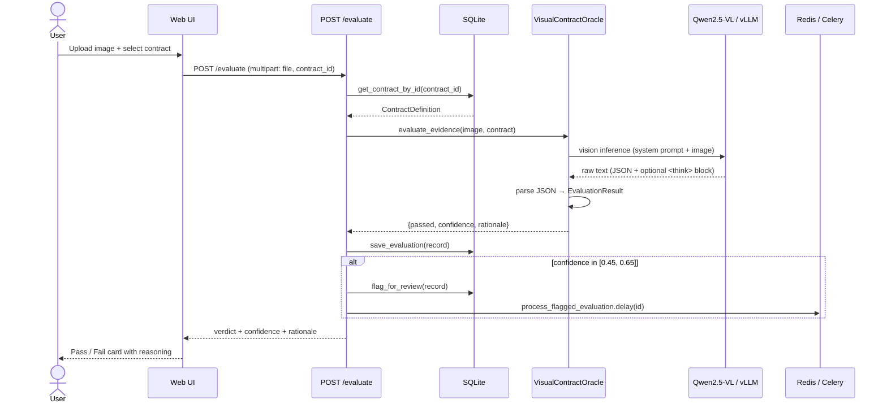
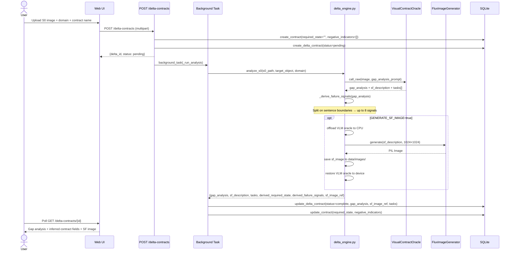
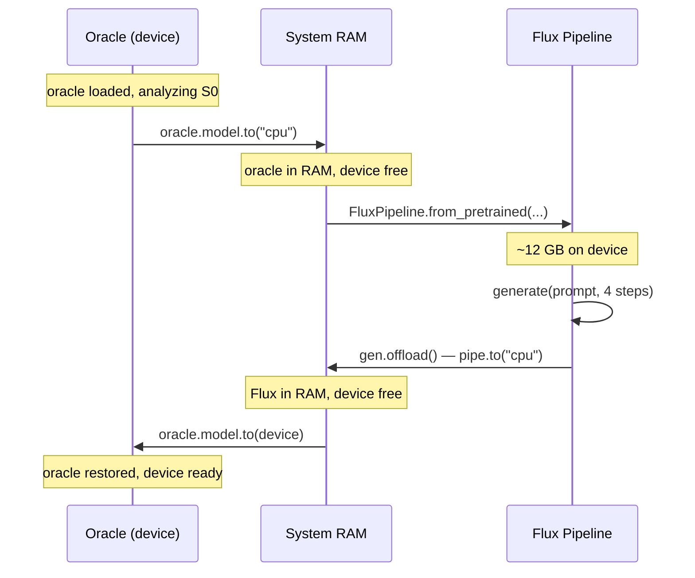
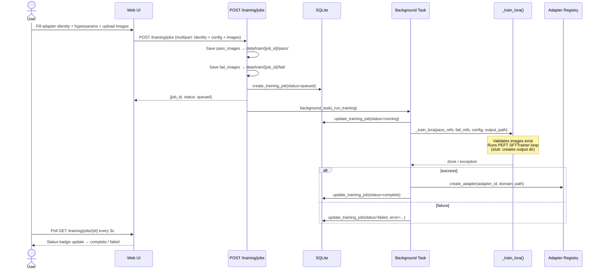
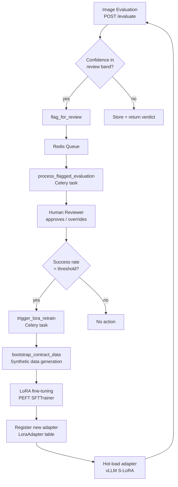
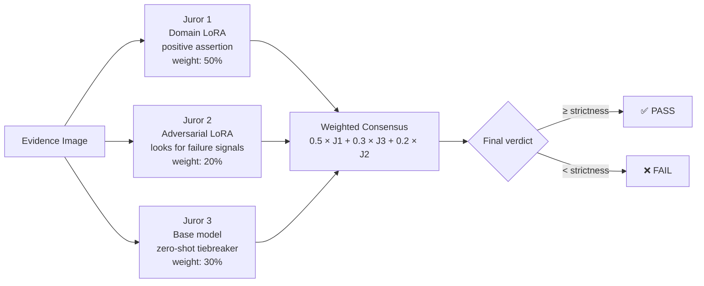
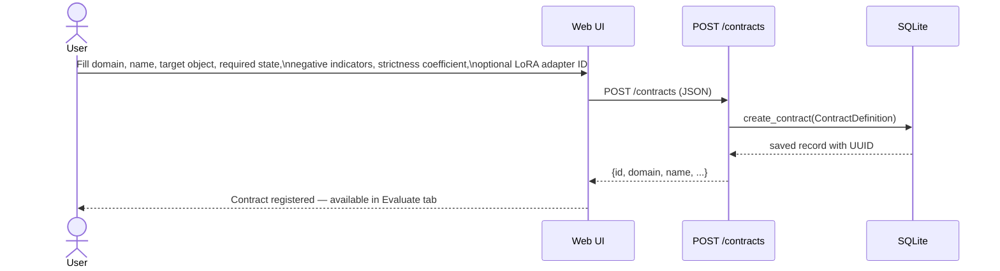

# Workflows

## 1. Image Evaluation

The core pipeline: submit an image against a registered contract and receive a structured verdict.

### Confidence Bands

| Range | Action |
|-------|--------|
| `< lower` (0.45) | Auto-FAIL, no human review |
| `[0.45, 0.65]` | Route to human review queue |
| `> upper` (0.65) | Auto-PASS if `confidence >= strictness_coefficient` |

The `strictness_coefficient` (per contract, default 0.80) is the final pass threshold — a contract with `strictness=0.90` requires higher confidence to auto-pass.

---

## 2. Delta Contract — S0 → SF Analysis

Analyzes the current state of an object, identifies gaps, and produces a task plan plus an optional synthetic target-state image.

### Memory Swap for Dual-Model Inference

When both Qwen2.5-VL (~14 GB) and FLUX.1-schnell (~12 GB) are used on the same device:

---

## 3. LoRA Training Job

Submit labeled PASS/FAIL images to fine-tune a domain-specific LoRA adapter.

---

## 4. Active Learning Loop

Continuous model improvement driven by low-confidence evaluations and human review.

**Thresholds** (configurable via `.env`):

| Variable | Default | Meaning |
|----------|---------|---------|
| `HUMAN_REVIEW_LOWER` | 0.45 | Lower confidence band boundary |
| `HUMAN_REVIEW_UPPER` | 0.65 | Upper confidence band boundary |
| `LORA_RETRAIN_THRESHOLD` | 0.95 | Min accuracy before retrain triggers |
| `LORA_RETRAIN_WINDOW` | 100 | # of human-reviewed records to measure |

---

## 5. vLLM Juror Panel

For critical evaluations in production, three independent jurors vote:

---

## 6. Contract Registration

